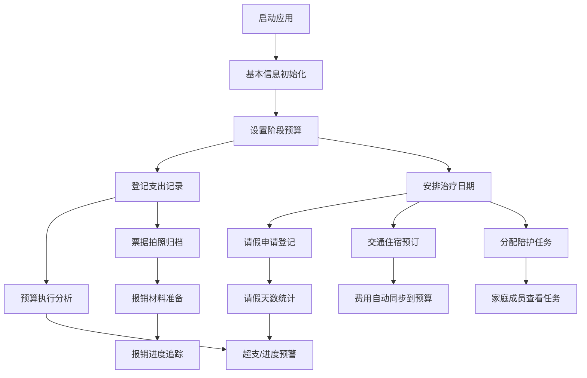

## 1. 产品概述

试管婴儿治疗协同管理工具，专为跨城就医家庭设计，解决"人要到哪天、钱要花多少、谁来陪"三大核心问题。帮助用户精打细算医疗开支、协调工作假期、统筹家庭分工，降低异地就医的生活压力。

### 1.1 核心价值
- **经济层面**：全流程预算管控，实时追踪支出，避免超支
- **时间层面**：治疗节点与假期安排联动，提前规划工作交接
- **家庭层面**：明确分工，责任到人，减少沟通成本
- **资料层面**：报销材料一站式管理，避免票据丢失

### 1.2 目标用户
- 跨城/异地接受试管婴儿治疗的夫妇家庭
- 需要兼顾工作和治疗的职场人群
- 需要多人协作陪护的家庭
- 对医疗支出敏感、需要精打细算的家庭

---

## 2. 核心功能

### 2.1 用户角色

| 角色 | 描述 | 核心权限 |
|------|------|----------|
| 主要用户（患者本人） | 正在接受治疗的一方 | 全部功能，编辑预算、登记支出、安排请假 |
| 配偶/家属 | 陪同治疗的家庭成员 | 查看数据、分配任务、登记陪护 |
| 其他协助人 | 如父母、朋友等 | 仅查看分配给自己的任务 |

### 2.2 功能模块总览

1. **疗程预算**：阶段性预算测算、检查和手术支出登记、总花费走势图表、阶段目标完成度
2. **请假安排**：请假天数统计、请假记录管理、单位证明材料清单、临时改期影响提示
3. **交通住宿**：交通行程管理、住宿预订提醒、费用登记、重要日期倒计时
4. **报销资料**：报销票据归类、材料清单管理、报销进度追踪
5. **家庭分工**：陪护轮值安排、家庭成员任务分配、压力备注、重要日期提醒

### 2.3 页面详情

| 页面名称 | 模块名称 | 功能描述 |
|----------|----------|----------|
| 疗程预算 | 预算设置 | 按治疗阶段（术前检查、促排卵、取卵、移植、黄体支持）设置预算金额 |
| 疗程预算 | 支出登记 | 记录检查费、药费、手术费等各项支出，支持分类标签 |
| 疗程预算 | 花费走势 | 折线图展示月度/阶段花费趋势，柱状图对比各阶段支出 |
| 疗程预算 | 完成度仪表盘 | 显示各阶段预算执行进度，超支预警提示 |
| 请假安排 | 请假记录 | 登记请假日期、类型（病假/年假/事假）、天数、工作交接人 |
| 请假安排 | 请假统计 | 按月份/类型统计请假天数，剩余假期余额计算 |
| 请假安排 | 单位证明 | 单位所需证明材料清单（诊断证明、请假条模板等） |
| 请假安排 | 改期影响 | 治疗日期调整时，自动计算对已安排请假的影响并提示 |
| 交通住宿 | 行程管理 | 登记往返交通信息（车次/航班号、时间、费用） |
| 交通住宿 | 住宿预订 | 记录酒店信息、入住日期、预订状态、退房提醒 |
| 交通住宿 | 费用汇总 | 交通和住宿费用统计，纳入总预算 |
| 交通住宿 | 重要提醒 | 出发倒计时、就诊日提醒、预订截止提醒 |
| 报销资料 | 票据管理 | 拍照/上传票据，按类别（门诊/住院/药品/检查）归类 |
| 报销资料 | 材料清单 | 医保/商业保险所需材料清单，勾选完成状态 |
| 报销资料 | 报销进度 | 记录报销申请时间、金额、到账状态 |
| 家庭分工 | 成员管理 | 添加家庭成员，设置角色和联系方式 |
| 家庭分工 | 陪护轮值 | 按日期安排陪护人员，支持周视图展示 |
| 家庭分工 | 任务分配 | 创建任务（取药、送饭、接送等），指派给家庭成员 |
| 家庭分工 | 压力备注 | 记录情绪状态、压力来源，支持私密备注 |
| 家庭分工 | 重要日期 | 治疗关键节点、纪念日、复查日等日历提醒 |

---

## 3. 核心流程

### 3.1 用户主流程

用户首次打开应用 → 初始化基本信息（治疗医院、所在城市、家庭成员）→ 进入疗程预算页面设置各阶段预算 → 按治疗进度登记支出 → 同步安排请假和交通住宿 → 上传报销票据 → 分配家庭陪护任务 → 随时查看数据统计和提醒

### 3.2 关键流程图

---

## 4. 用户界面设计

### 4.1 设计风格

**设计调性**：温暖专业 · 安心可靠 · 简洁实用

- **主色调**：温暖蓝绿色 `#3DBAB0`（代表希望、生命、专业）
- **辅助色**：柔橙色 `#FF9F6B`（代表温暖、关怀、提醒）
- **警示色**：珊瑚红 `#F26B6B`（代表超支、紧急）
- **中性色**：暖灰 `#5A6670`、浅灰 `#F5F7F9`、白色 `#FFFFFF`
- **背景色**：柔和渐变，从浅蓝绿到米白，营造安心氛围

**字体选择**：
- 标题字体：`Noto Sans SC`，稳重现代
- 正文字体：系统无衬线字体，清晰易读
- 数字字体：等宽字体，便于金额和日期对比

**组件风格**：
- 卡片式布局，圆角 `12px`，柔和阴影
- 按钮采用圆角胶囊设计，主按钮蓝绿色，辅助按钮浅灰描边
- 数据可视化采用柔和渐变色块，避免刺眼
- 图标使用 `lucide-react` 线性图标，简洁统一

### 4.2 页面设计概览

| 页面名称 | 模块名称 | UI元素与风格 |
|----------|----------|-------------|
| 疗程预算 | 顶部概览 | 三张数据卡片并排：总预算、已支出、剩余预算，带趋势小箭头 |
| 疗程预算 | 预算设置 | 折叠面板，按治疗阶段分组，每个阶段含进度条和金额输入 |
| 疗程预算 | 支出登记 | 模态弹窗表单，下拉选择类别，日期选择器，金额输入，备注 |
| 疗程预算 | 支出列表 | 时间轴样式，按日期分组，每项显示类别图标、金额、备注 |
| 疗程预算 | 图表区域 | 折线图+柱状图组合，支持切换"月度/阶段"视图 |
| 请假安排 | 请假日历 | 月视图日历，请假日期高亮显示，悬浮显示详情 |
| 请假安排 | 统计卡片 | 环形进度图展示各类假期使用比例，数字显示剩余天数 |
| 请假安排 | 改期提示 | 橙色警示卡片，列出受影响的请假记录，支持一键调整 |
| 交通住宿 | 行程卡片 | 横向时间轴，展示往返交通信息，含状态标签（已预订/待确认） |
| 交通住宿 | 住宿卡片 | 酒店信息卡片，显示入住退房日期，带倒计时标签 |
| 交通住宿 | 提醒区域 | 置顶横幅，显示最近的出行/就诊倒计时 |
| 报销资料 | 票据分类 | 标签页切换，每类票据显示数量和总金额 |
| 报销资料 | 材料清单 | 复选框列表，已完成项绿色打钩，未完成项灰色 |
| 家庭分工 | 成员头像 | 圆形头像+角色标签，横向排列，点击查看个人任务 |
| 家庭分工 | 轮值周历 | 7列网格，每格显示日期和陪护人员头像 |
| 家庭分工 | 任务看板 | 三列看板：待办/进行中/已完成，支持拖拽 |
| 家庭分工 | 压力备注 | 情绪选择器（5个表情），文字输入框，可设为私密 |

### 4.3 响应式设计

- **桌面端（默认）**：侧边导航栏固定，主内容区最大宽度 `1200px`，多卡片并排布局
- **平板端**：导航栏收起为图标菜单，内容区自适应，2列卡片布局
- **移动端**：底部导航栏，单列卡片布局，日历简化为周视图，图表支持滑动查看

### 4.4 动效设计

- 页面切换：淡入淡出 + 轻微向上位移，时长 `300ms`
- 卡片悬停：阴影加深 + 轻微上浮，时长 `200ms`
- 数据更新：数字滚动动画，从旧值过渡到新值
- 提醒出现：顶部滑入 + 轻微震动效果
- 进度条加载：从0到当前值的填充动画

---

## 5. 非功能需求

### 5.1 数据安全
- 所有数据本地存储（LocalStorage + IndexedDB），不上传云端
- 支持设置应用锁（PIN码或指纹）
- 敏感数据（医疗记录、金额）支持加密存储
- 支持数据导出备份（JSON格式）和导入恢复

### 5.2 性能要求
- 首屏加载时间 < 2秒
- 页面切换无明显卡顿
- 支持离线使用（纯前端应用）

### 5.3 易用性
- 新手引导：首次使用时展示5个页面的功能介绍
- 数据导入：支持从Excel/CSV导入历史支出记录
- 键盘快捷键：常用操作支持快捷键（Ctrl+N新建支出）
- 深色模式：支持切换深色/浅色主题

---

## 6. 里程碑规划

| 阶段 | 交付内容 | 工作量估计 |
|------|----------|-----------|
| M1 原型 | 页面框架、路由导航、Mock数据演示 | 1天 |
| M2 核心功能 | 预算管理、支出登记、基础数据统计 | 2天 |
| M3 完整功能 | 所有5个页面功能、本地存储 | 2天 |
| M4 优化完善 | 图表可视化、响应式、动效优化 | 1天 |
| M5 测试交付 | 功能测试、Bug修复、用户文档 | 1天 |
