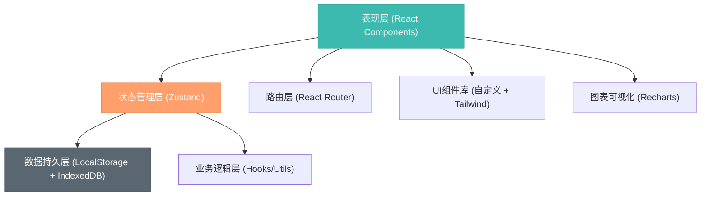
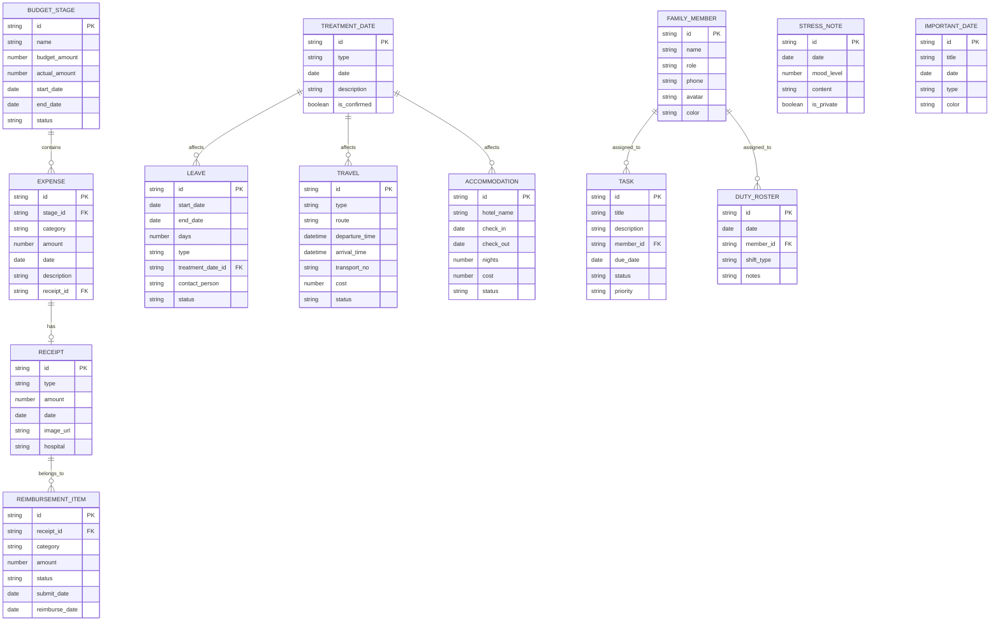

## 1. 架构设计

本项目为纯前端轻量桌面应用，采用React + TypeScript技术栈，数据完全本地存储，无需后端服务。架构分为表现层、状态管理层、数据持久层三层。



### 1.1 架构分层说明

- **表现层**：5个核心页面组件 + 通用UI组件，负责数据展示和用户交互
- **状态管理层**：Zustand全局状态管理，统一管理预算、请假、交通、报销、家庭分工等数据
- **数据持久层**：LocalStorage存储结构化数据，IndexedDB存储票据图片等大文件
- **业务逻辑层**：自定义Hooks封装计算逻辑（预算统计、请假天数计算、改期影响分析等）

---

## 2. 技术选型

| 类别 | 技术栈 | 版本 | 用途说明 |
|------|--------|------|----------|
| 前端框架 | React | 18.x | UI构建 |
| 开发语言 | TypeScript | 5.x | 类型安全 |
| 构建工具 | Vite | 5.x | 快速构建 |
| 路由 | react-router-dom | 6.x | 页面路由 |
| 状态管理 | zustand | 4.x | 全局状态 |
| 样式 | tailwindcss | 3.x | 原子化CSS |
| 图表 | recharts | 2.x | 数据可视化 |
| 图标 | lucide-react | 0.x | 线性图标库 |
| 日期处理 | date-fns | 3.x | 日期计算格式化 |
| 数据存储 | LocalStorage | - | 结构化数据持久化 |
| 数据存储 | IndexedDB | - | 大文件/图片存储 |

---

## 3. 目录结构

```
c:\TraeProjects\1100/
├── src/
│   ├── components/           # 通用组件
│   │   ├── layout/          # 布局组件（侧边栏、顶部导航）
│   │   ├── ui/              # 基础UI组件（按钮、卡片、表单等）
│   │   └── charts/          # 图表组件
│   ├── pages/               # 页面组件
│   │   ├── Budget/          # 疗程预算页面
│   │   ├── Leave/           # 请假安排页面
│   │   ├── Travel/          # 交通住宿页面
│   │   ├── Reimbursement/   # 报销资料页面
│   │   └── Family/          # 家庭分工页面
│   ├── store/               # Zustand状态管理
│   │   ├── useBudgetStore.ts
│   │   ├── useLeaveStore.ts
│   │   ├── useTravelStore.ts
│   │   ├── useReimbursementStore.ts
│   │   └── useFamilyStore.ts
│   ├── hooks/               # 自定义Hooks
│   │   ├── useBudgetStats.ts
│   │   ├── useLeaveStats.ts
│   │   └── useLocalStorage.ts
│   ├── utils/               # 工具函数
│   │   ├── date.ts
│   │   ├── storage.ts
│   │   └── calculation.ts
│   ├── types/               # TypeScript类型定义
│   │   ├── budget.ts
│   │   ├── leave.ts
│   │   ├── travel.ts
│   │   ├── reimbursement.ts
│   │   └── family.ts
│   ├── mock/                # Mock数据（开发用）
│   │   └── index.ts
│   ├── App.tsx              # 根组件
│   ├── main.tsx             # 入口文件
│   └── index.css            # 全局样式
├── public/                  # 静态资源
├── .trae/
│   └── documents/           # 项目文档
├── package.json
├── tsconfig.json
├── vite.config.ts
├── tailwind.config.js
└── postcss.config.js
```

---

## 4. 路由定义

| 路由路径 | 页面名称 | 组件路径 |
|----------|----------|----------|
| `/` | 疗程预算（首页） | `@/pages/Budget/index.tsx` |
| `/budget` | 疗程预算 | `@/pages/Budget/index.tsx` |
| `/leave` | 请假安排 | `@/pages/Leave/index.tsx` |
| `/travel` | 交通住宿 | `@/pages/Travel/index.tsx` |
| `/reimbursement` | 报销资料 | `@/pages/Reimbursement/index.tsx` |
| `/family` | 家庭分工 | `@/pages/Family/index.tsx` |

---

## 5. 数据模型

### 5.1 实体关系图



### 5.2 核心数据结构定义

#### 预算相关类型

```typescript
// 治疗阶段
interface BudgetStage {
  id: string;
  name: '术前检查' | '促排卵' | '取卵' | '移植' | '黄体支持' | '其他';
  budgetAmount: number;
  actualAmount: number;
  startDate: string;
  endDate: string;
  status: '未开始' | '进行中' | '已完成';
}

// 支出记录
interface Expense {
  id: string;
  stageId: string;
  category: '检查费' | '药品费' | '手术费' | '化验费' | '其他';
  amount: number;
  date: string;
  description: string;
  receiptId?: string;
  createdAt: string;
}
```

#### 请假相关类型

```typescript
// 请假记录
interface LeaveRecord {
  id: string;
  startDate: string;
  endDate: string;
  days: number;
  type: '病假' | '年假' | '事假' | '调休';
  treatmentDateId?: string;
  contactPerson: string;
  status: '待审批' | '已批准' | '已取消';
  reason: string;
}

// 假期余额
interface LeaveBalance {
  type: string;
  total: number;
  used: number;
  remaining: number;
}
```

#### 交通住宿类型

```typescript
// 交通行程
interface Travel {
  id: string;
  type: '高铁' | '飞机' | '自驾' | '其他';
  route: string;
  departureTime: string;
  arrivalTime: string;
  transportNo: string;
  cost: number;
  status: '待预订' | '已预订' | '已完成' | '已取消';
  notes: string;
}

// 住宿
interface Accommodation {
  id: string;
  hotelName: string;
  checkIn: string;
  checkOut: string;
  nights: number;
  cost: number;
  status: '待预订' | '已预订' | '已入住' | '已退房';
  address: string;
  phone: string;
}
```

#### 报销相关类型

```typescript
// 票据
interface Receipt {
  id: string;
  type: '门诊' | '住院' | '药品' | '检查' | '其他';
  amount: number;
  date: string;
  imageUrl: string;
  hospital: string;
  isReimbursed: boolean;
}

// 报销记录
interface Reimbursement {
  id: string;
  receiptIds: string[];
  category: '医保' | '商业保险' | '单位报销';
  totalAmount: number;
  reimbursedAmount: number;
  status: '待提交' | '审核中' | '已报销' | '已驳回';
  submitDate?: string;
  reimburseDate?: string;
  notes: string;
}

// 材料清单
interface MaterialItem {
  id: string;
  name: string;
  category: string;
  isCompleted: boolean;
  notes: string;
}
```

#### 家庭分工类型

```typescript
// 家庭成员
interface FamilyMember {
  id: string;
  name: string;
  role: '患者' | '配偶' | '父母' | '朋友' | '其他';
  phone: string;
  avatar: string;
  color: string;
}

// 任务
interface Task {
  id: string;
  title: string;
  description: string;
  memberId: string;
  dueDate: string;
  status: '待办' | '进行中' | '已完成';
  priority: '高' | '中' | '低';
}

// 陪护轮值
interface DutyRoster {
  id: string;
  date: string;
  memberId: string;
  shiftType: '全天' | '上午' | '下午' | '夜间';
  notes: string;
}

// 压力备注
interface StressNote {
  id: string;
  date: string;
  moodLevel: 1 | 2 | 3 | 4 | 5;
  content: string;
  isPrivate: boolean;
}

// 重要日期
interface ImportantDate {
  id: string;
  title: string;
  date: string;
  type: '治疗' | '复查' | '纪念日' | '其他';
  color: string;
}
```

---

## 6. 状态管理设计

### 6.1 Store 划分

采用按领域划分的多Store模式，每个Store负责一个功能模块：

```typescript
// useBudgetStore.ts - 预算管理
interface BudgetState {
  stages: BudgetStage[];
  expenses: Expense[];
  addExpense: (expense: Omit<Expense, 'id' | 'createdAt'>) => void;
  updateExpense: (id: string, data: Partial<Expense>) => void;
  deleteExpense: (id: string) => void;
  updateStageBudget: (stageId: string, amount: number) => void;
  getTotalBudget: () => number;
  getTotalExpense: () => number;
  getStageExpense: (stageId: string) => number;
}

// useLeaveStore.ts - 请假管理
interface LeaveState {
  records: LeaveRecord[];
  balances: LeaveBalance[];
  treatmentDates: TreatmentDate[];
  addLeave: (leave: Omit<LeaveRecord, 'id'>) => void;
  updateLeave: (id: string, data: Partial<LeaveRecord>) => void;
  deleteLeave: (id: string) => void;
  getLeaveDaysByMonth: (month: string) => number;
  getAffectedLeaves: (treatmentDateId: string) => LeaveRecord[];
}

// 其他Store类似...
```

### 6.2 数据持久化

使用 `zustand/middleware` 的 `persist` 中间件，自动将状态同步到LocalStorage：

```typescript
import { create } from 'zustand';
import { persist } from 'zustand/middleware';

export const useBudgetStore = create<BudgetState>()(
  persist(
    (set, get) => ({
      // ... state and actions
    }),
    {
      name: 'ivf-budget-storage',
    }
  )
);
```

---

## 7. 关键业务逻辑

### 7.1 预算统计计算

```typescript
// hooks/useBudgetStats.ts
export function useBudgetStats() {
  const { stages, expenses, getTotalBudget, getTotalExpense } = useBudgetStore();

  const totalBudget = getTotalBudget();
  const totalExpense = getTotalExpense();
  const remaining = totalBudget - totalExpense;
  const progress = totalBudget > 0 ? (totalExpense / totalBudget) * 100 : 0;

  const stageStats = stages.map(stage => ({
    ...stage,
    spent: getStageExpense(stage.id),
    remaining: stage.budgetAmount - getStageExpense(stage.id),
    progress: stage.budgetAmount > 0 
      ? (getStageExpense(stage.id) / stage.budgetAmount) * 100 
      : 0,
    isOverBudget: getStageExpense(stage.id) > stage.budgetAmount,
  }));

  const monthlyExpenses = groupExpensesByMonth(expenses);

  return {
    totalBudget,
    totalExpense,
    remaining,
    progress,
    stageStats,
    monthlyExpenses,
    isOverBudget: totalExpense > totalBudget,
  };
}
```

### 7.2 改期影响分析

```typescript
// hooks/useRescheduleImpact.ts
export function useRescheduleImpact() {
  const { records, treatmentDates } = useLeaveStore();
  const travels = useTravelStore(state => state.travels);
  const accommodations = useTravelStore(state => state.accommodations);
  const rosters = useFamilyStore(state => state.rosters);

  const calculateImpact = (oldDate: string, newDate: string) => {
    const affectedLeaves = records.filter(l => 
      l.treatmentDateId && datesOverlap(l.startDate, l.endDate, oldDate, oldDate)
    );
    
    const affectedTravels = travels.filter(t => 
      sameDay(t.departureTime, oldDate) || sameDay(t.arrivalTime, oldDate)
    );
    
    const affectedAccommodations = accommodations.filter(a =>
      datesOverlap(a.checkIn, a.checkOut, oldDate, oldDate)
    );
    
    const affectedRosters = rosters.filter(r => r.date === oldDate);

    return {
      leaves: affectedLeaves,
      travels: affectedTravels,
      accommodations: affectedAccommodations,
      rosters: affectedRosters,
      totalAffected: affectedLeaves.length + affectedTravels.length + 
                     affectedAccommodations.length + affectedRosters.length,
    };
  };

  return { calculateImpact };
}
```

---

## 8. 性能优化策略

1. **组件拆分**：每个页面拆分为多个小组件，避免不必要的重渲染
2. **记忆化**：使用 `useMemo`、`useCallback` 缓存计算结果和回调函数
3. **虚拟滚动**：支出列表、任务列表等长列表使用虚拟滚动
4. **懒加载**：图表组件和重型组件按需加载
5. **防抖节流**：搜索、筛选等操作添加防抖
6. **状态隔离**：各模块Store独立，避免跨模块状态更新导致的全量重渲染

---

## 9. 开发规范

### 9.1 命名规范
- 组件：PascalCase（`BudgetCard.tsx`）
- 变量函数：camelCase（`calculateTotal`）
- 常量：UPPER_SNAKE_CASE（`CATEGORY_OPTIONS`）
- 类型接口：PascalCase + I 前缀（`IExpense`）或不加前缀（推荐）

### 9.2 代码规范
- 使用 TypeScript 严格模式
- 组件文件不超过 300 行，超过则拆分
- 每个组件职责单一
- 使用绝对路径导入（`@/components/...`）
- 避免 `any` 类型，必要时使用 `unknown`

### 9.3 提交规范
- feat: 新功能
- fix: Bug修复
- docs: 文档更新
- style: 代码格式调整
- refactor: 重构
- perf: 性能优化
- test: 测试相关
